# 👋 HI THERE
## I'm Mini-Qussa — Russian Full-stack developer & Enthusiast

  
  
  

---

> Коментарии?? не, не слышал ._.

 <h2>My active 📈</h2>

> Не много, но сойдет :p
---

<h3> GitHub Metrics </h3>

  

---

<h2> Language: (And HTML :) ) </h2>

| Ico | Lang | Status | : | Ico | Lang | Status|
| :-: | :--- | :----: |:-: | :-: | :--- | :----:|
| |**Rust**|Learning 📚| : |  | Java Script | 50/50 |
| | **Python** | Know 🤓 | : |  |  |  |
|| **Go** | Know 🤓 | :|  |  |  |
|| **HTML**| Know 🤓 | : |  |  |  |

<h3> My Soft </h3>

---

<h2> Links </h2>

<h3> Спасибо за посещение ❤️ ☕
